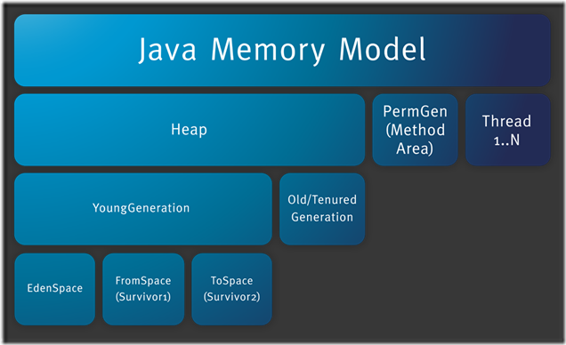

## Java Running Data Area
   
这个图比较直观：  
Java 内存模型图 （JMM）  
有的面试官也会直接问你了解JMM吗，哎，他跟你玩小套路不问你Java内存模型给你来个jmm。你要知道他俩是一个东西。  
先解释一下这个图    
第一行代表总的 `Java 内存`  
第二行就被细分了三部分：`Java堆`，`方法区`，`线程私有的内存部分`  
第三行对`Java堆`进行分代，年轻人 and 老年人  
第四行堆Java内存中的`年轻人`再次细分。  
  
  
    
        
  
  
对这个图进行简单的描述一下：  
class文件经过类加载器加载之后，被弄到内存中去，这个内存区域叫做 运行时数据区（running data area）  
然后，Java代码就会进行一系列暗箱操作，最终执行出结果。   
这张图，观众姥爷们肯定不止一次见过这个图。  
但是，我猜  
观众看这张图时，选择性的只看到了图中的5个区域。  
也就是说Java 运行时数据区域被分成的5个区域。这张图就算过去了。  
其实，要是真的看明白这个图，那需要懂不少东西的。  
这个就放在详细了解完几个子区域之后，再回过头来，那这张图讲事情。  
  
这个图，每次再学习单个子区域的时候，都不嫌麻烦的摆一下吧  
越是多看几眼，越是希望能牢记Java内存的几个分区  
因为，能清清楚楚明明白白把这个分区顺利说出来的，真没几个，即使是你看了所谓的jvm相关的书  
所以，我希望，在看这个文章的时候，想达到的效果就是：  
真的记住了，就像问你英文字母有几个的时候，秒秒钟回答：26个。  