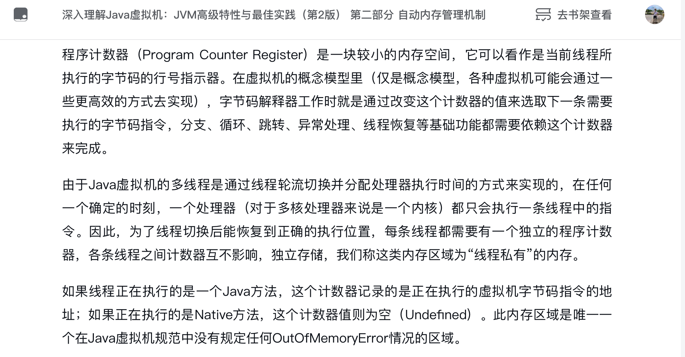

## Program Counter Register
  
    
  

  
### 程序计数器
  
这个截图中的描述，都是别人封装过的代码。  
搞开发的，最怕或者说最不愿意的就是看别人的代码。  
可能是写的太草体，不堪入目；也可能是封装的太优雅，咱水平有限，看不太懂。  
那此处肯定是封装的太优雅了，不然也不可能出书呀，咱理解起来费劲了点。  
  

对上面的描述进行总结，有以下几点可以着重记住：
0. 存储下一次要去干啥的命令`next to do`
1. 这个区域很`小`  
2. 这个区域是`线程私有的`  
3. 内存溢出(Out Of Memory Error)的bug与我无关，即 `never OOM`
4. 每个线程都有一个总司令，指挥一个线程的 next to do
