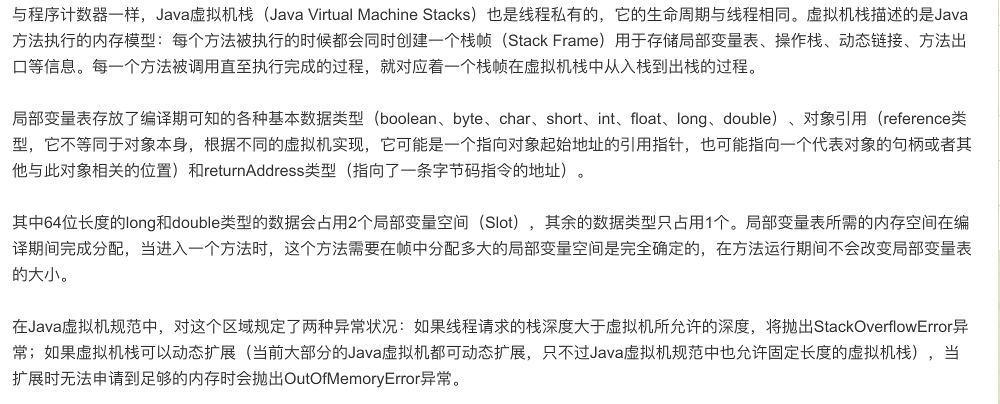

## Java Virtual Machine Stacks
  
  
  

  
### Java虚拟机栈
  
  
###  线程私有 与线程同生死  
`栈`  当初学数据结构的时候，他的特点：先进去后出来。  
每次执行方法的时候，方法是一层层的嵌套调用的，那么如上描述的那样，有个栈结构来存储执行的方法（栈帧）  
万物皆对象，栈结构存一个个执行的方法，然后一个个的先执行执行完之后出栈。最终栈就又是干干净净的了。  
  
###  内存异常之--栈溢出异常  
上面那个方法执行的套路了解之后，方法执行就是一层层的嵌套执行，一般这个层数是比较低调的。不会出现栈溢出的bug。  
若是不小心弄个递归调用，递归条件中没得break，那这个递归调用就分分钟的弄了很多层，超出虚拟机设置的最大栈深度，他就出这个异常了。  
上面说的动态可扩展，就是这个栈深度在虚拟机启动的时候，根据参数去设置。  
用乘电梯举例子：  
此内存模块  栈溢出 == 虽然还没超重呢，但是电梯人数已经超了。。。  

###  内存异常之--内存溢出异常
栈结构就跟我们使用的map结构似的，栈里面存的执行方法（栈帧）就类似我们map中put的object。  
每个执行的方法，也会存不少东西，这些东西都是会占空间的，假如每个方法占的空间又很多。  
那么在栈的深度还没使用完的时候，栈的内存就使用了。那就内存溢出了。  
用乘电梯举例子：  
此内存模块  内存溢出 == 电梯人数限制没达到，但是已经超重了。。。  
  
对上面的描述进行总结，有以下几点可以着重记住：
1. `2个异常`  
2. `StackOverflowError`和`OutOfMemoryError`异常出现的原因   
3. 主要用来`存`执行Java方法需要的信息的地方
