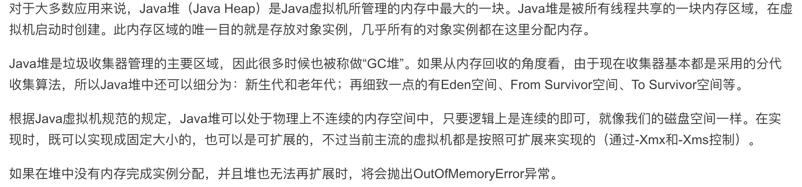

## Java Heap
  
  
  

  
### Java堆
  
  
这个是Java堆了，最大的一块，一般对程序内存优化，都是针对这个优化的。  
gc也主要是在这个地方进行的。  
所有的线程都在这个地方生成使用的对象  
Eden空间：(翻译：伊甸园)西方神话，亚当夏娃呆的地方，这地方是天堂，新生对象都是出在这个地方的  
From Survivor/To Survivor：两个幸存者空间 之所以年轻代区域又这么分三个子区域，也是为内存回收策略服务的。  
对象实例在此分配空间诞生，完事儿就gg了。  

对上面的描述进行总结，有以下几点可以着重记住：
1. 这个区域很`大`  
2. 这个区域是`多线程私共享`   
3. `对象实例`存在于此，无空间分配得下给对象，就`OOM`异常  
4. `GC`主要战场  
5. 主要用来`存各种对象的实例`，其他地方使用的时候就是个地址，指向此地的对象实例。  
