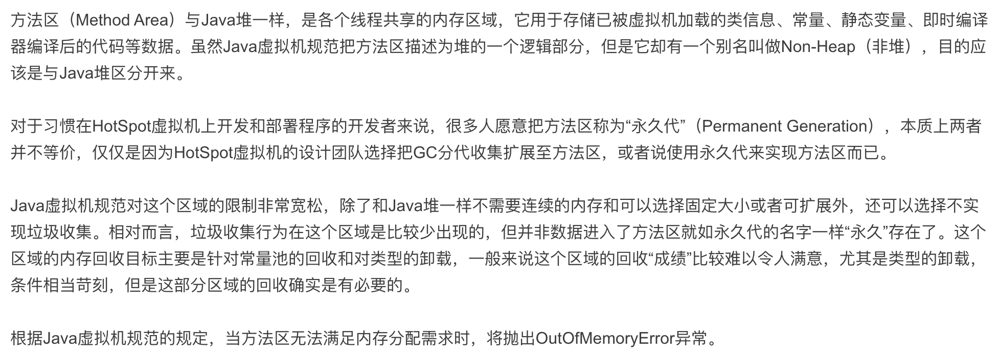

## Method Area
  
  
  

  
### 方法区
  
  
### 方法区中的运行时常量池  
用于存放编译期生成的各种字面量和符号引用  
String类的intern()方法  
  
  
对上面的描述进行总结，有以下几点可以着重记住：
1. 这个区域是`多线程共享`   
2. 存储已被虚拟机加载的`类信息`、`常量`、`静态变量`  
3. `OutOfMemoryError`  
4. `运行时常量池`就在这个区域